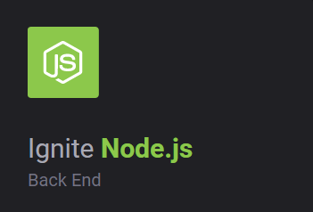

# :rocket: Ignite Rocketseat Node

<a href="https://rocketseat.com.br/" target="_blank">Rocketseat</a> Ignite Node Course.



## :file_folder: Folders
#### /chapter-1
* fundamentals-nodejs\
Node application basics of a project created from ``` yarn init -y ```

